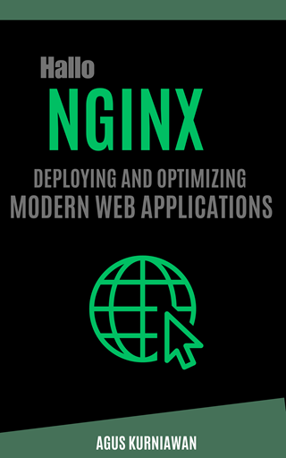

# Hallo Nginx: Deploying and Optimizing Modern Web Applications

**Hallo Nginx: Deploying and Optimizing Modern Web Applications** is an essential guidebook for web developers, system administrators, and IT professionals looking to master NGINX, the heart of modern web architectures. This comprehensive resource covers everything from basic configurations to advanced features, making it an invaluable asset for anyone aiming to deploy, secure, and optimize web applications efficiently. With its clear structure, starting from the introduction to NGINX's core concepts and progressing through to complex configurations and performance tuning, the book promises to elevate your skills and understanding of web server management to new heights.

Dive deep into the world of NGINX with detailed chapters on domain mastery, security, advanced protocols, and more. Whether you're serving dynamic web applications, implementing robust security measures, or scaling services through load balancing and redirection, **Hallo Nginx** offers practical insights and strategies for overcoming common challenges. The book's unique approach combines theoretical knowledge with 46 hands-on lab exercises, enabling readers to apply what they've learned in real-world scenarios. These exercises are designed to reinforce concepts and provide practical experience, making the learning process both effective and engaging.

Beyond the basics, **Hallo Nginx** explores the extended capabilities of NGINX, including its commercial offering, NGINX Plus, and how to leverage its advanced features for enterprise environments. The chapters on API gateway essentials, advanced caching, and performance tuning are particularly relevant for professionals working with high-traffic sites. Additionally, the book offers troubleshooting tips and best practices to keep your web applications running smoothly. Whether you're new to NGINX or looking to expand your expertise, **Hallo Nginx: Deploying and Optimizing Modern Web Applications** is your go-to resource for mastering one of the most powerful and versatile web servers available today.

## Hands-on Lab Exercises
This is a list of the exercises in the book. Each exercise is designed to help you learn the concepts and techniques discussed in the book.

- Exercise 1: Installing and Running NGINX on VMs and Docker
- Exercise 2: Configuring NGINX: Directives and Contexts Explained
- Exercise 3: Essential NGINX Commands and Controls
- Exercise 4: Understanding the Basic NGINX Server Block
- Exercise 5: Deploying Multiple Web Applications on Different Ports
- Exercise 6: Configuring Domains and Subdomains
- Exercise 7: Deploying a Static Web App for Domain Testing
- Exercise 8: Domain Redirects and Wildcard Configurations
- Exercise 9: Implementing SSL/TLS for Domains and Subdomains using Let’s Encrypt
- Exercise 10: Powering a Node.js App with NGINX
- Exercise 11: Integrating a Spring Boot Application
- Exercise 12: Serving an ASP.NET Core Application with NGINX
- Exercise 13: Amplifying PHP Apps with NGINX and PHP-FPM
- Exercise 14: Deploying Angular Web Apps with NGINX
- Exercise 15: Deploying React JS Web Apps with NGINX
- Exercise 16: Streamlining FastAPI Python Apps with NGINX
- Exercise 17: Setting up WebSockets for Real-Time Communication
- Exercise 18: Leveraging HTTP/for Enhanced Performance with Static Web Apps
- Exercise 19: Serving gRPC Services with NGINX
- Exercise 20: Setting Up SSL/TLS for Encrypted Connections
- Exercise 21: Hardening NGINX with Security Headers
- Exercise 22: Guarding Against Web Vulnerabilities
- Exercise 23: Crafting Efficient Reverse Proxy Setups
- Exercise 24: Implementing Load Balancing Strategies
- Exercise 25: Mastering URL Redirection and Rewrites
- Exercise 26: Implementing API Rate Limiting with NGINX Open Source
- Exercise 27: Transforming and Routing API Traffic
- Exercise 28: API Security and JWT Authentication with Open-Source NGINX
- Exercise 29: Setting Up and Configuring NGINX Proxy Cache
- Exercise 30: Cache Strategies for Dynamic Web Content
- Exercise 31: Optimizing Connection and Buffer Settings
- Exercise 32: Employing Compression for Faster Web Delivery
- Exercise 33: Fine-Tuning Static and Media File Delivery
- Exercise 34: Standard and Third-Party Module Integration
- Exercise 35: Extending NGINX with Lua Scripting
- Exercise 36: Removing NGINX Server Header for Less Information Leakage
- Exercise 37: Advanced Logging with Custom Formats
- Exercise 38: Real-time Monitoring and Traffic Analysis
- Exercise 39: Deploying NGINX Plus on an VM
- Exercise 40: Leveraging Exclusive NGINX Plus Features
- Exercise 41: API Security and JWT Authentication with NGINX Plus
- Exercise 42: Performance and Monitoring with NGINX Plus
- Exercise 43: Advanced Load Balancing and Clustering in NGINX Plus
- Exercise 44: Diagnosing Common NGINX Issues
- Exercise 45: Performance Diagnosis and Remediation
- Exercise 46: Best Practices for Scalable NGINX Deployments

## How to Buy

You can buy this book the following online stores:

* Google Play Books: https://play.google.com/store/books/details?id=2v75EAAAQBAJ
* Lulu: https://www.lulu.com/shop/agus-kurniawan/hallo-nginx-deploying-and-optimizing-modern-web-applications/ebook/product-nvq9w24.html
* Apple iBookstore: http://books.apple.com/us/book/id6479160924
* Leanpub: https://leanpub.com/hallo-nginx 
